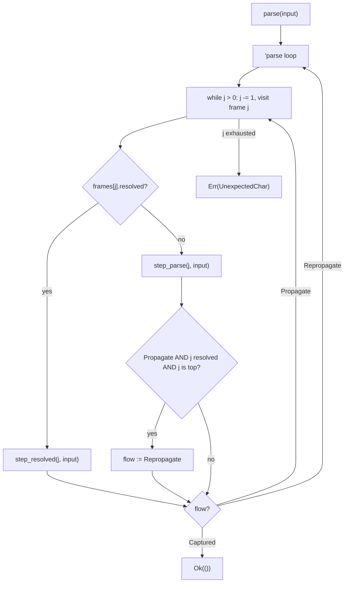
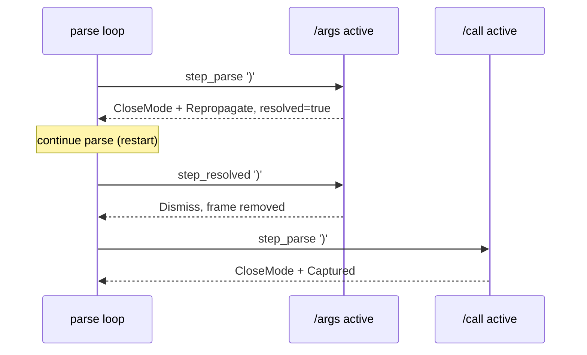
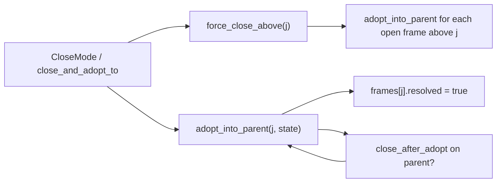

# ParseStack control flow

Notes on [`src/core/parser/stack.rs`](../../src/core/parser/stack.rs): how one input character moves through the stack and how `ParsetStepFlow` drives it.

---

## Data model

```text
ParseStack
├── frames: Vec<ParseFrame>     // index 0 = root, last = active top
└── on_change: Option<Fn>       // only with feature "parse-trace"

ParseFrame
├── mode: Box<dyn ParseMode>
└── resolved: bool              // true = closed, waiting on_parse_resolved or to be dismissed
```

Stack grows **down** in traces (`/program/instruction/call/args` = indices `[0, 1, 2, 3]`).

Two phases per frame:

| Phase | Handler | Typical use |
|-------|---------|-------------|
| Active (`resolved = false`) | `on_parse` | Consuming opening syntax, starting children |
| Resolved (`resolved = true`) | `on_parse_resolved` | Postfix ops, accessors, dismiss, force-dismiss |

Mutations (`ParseStepMutation` / `ParseResolveMutation`) change `frames` and sometimes mark a frame resolved without removing it.

---

## `ParsetStepFlow`

| Flow | Meaning |
|------|---------|
| `Captured` | Char consumed; end `parse()` for this char |
| `Propagate` | Continue the inner `while` to parent frames (same pass) |
| `Repropagate` | `continue 'parse` — full top→bottom re-walk with the same char |

Modes return **`Repropagate`** explicitly when a mutation changes the active stack shape and the same char must be offered to the new/replaced frame (and ancestors) from the top — e.g. `StartMode`, `ReplaceMode`, `ParentForceDismissAndStartMode`.

The stack also upgrades **`Propagate` → `Repropagate`** after `step_parse` when the frame just became **resolved** and is still the **top** index. That covers `CloseMode + Propagate` on value leaves (`/integer` before `;`, `/args` before `)`) without modes needing to know stack depth.

---

## High-level: one character, one `parse()` call



**Bottom-up walk:** `j` starts at `len`, decrements before each visit, so the **top** frame is tried first, then parents.

**Captured stops everything:** first frame that returns `Captured` ends `parse()` successfully for this char.

**Propagate continues:** same char may be offered to frames lower on the stack (smaller `j`).

**Repropagate restarts:** same char is offered again from the top — used after push/replace/dismiss-start mutations, and after close-on-top-with-propagate.

---

## Example: `/args` closing on `)`

| Step | Stack (top right) | What happens |
|------|-------------------|--------------|
| 1 | `…/call/args*` | `args.on_parse(')')` → `CloseMode`, adopt, `args.resolved = true`, `Repropagate` (explicit or via top-resolved upgrade) |
| 2 | `…/call/args✓` | Restart → `args.on_parse_resolved(')')` → Dismiss |
| 3 | `…/call*` | `call.on_parse(')')` → `CloseMode`, Captured |



---

## Helper chain (close / adopt)



`adopt_into_parent` may walk up resolved parents that do not `accepts_resolved_child`, then optionally reactivate or close the parent (`close_after_adopt` recursion).

---

## `emit_change` (parse-trace)

Uses `Fn(&ParseStack)` and borrows without moving the callback out of `&mut self`:

```rust
if let Some(on_change) = self.on_change.as_deref() {
  on_change(self);
}
```

---

## Mental model (short)

1. **`parse`** = walk top → bottom per `'parse` iteration.
2. **`Repropagate`** = restart that walk (modes set it for start/replace/dismiss-start; stack upgrades close-on-top `Propagate`).
3. **`Propagate`** = same pass, try parent frames via the inner `while`.
4. **`Captured`** = done for this char.

---

## Related files

- [`src/core/parser/step.rs`](../../src/core/parser/step.rs) — `ParseStepMutation`, `ParsetStepFlow`
- [`src/core/parser/mode.rs`](../../src/core/parser/mode.rs) — `ParseMode` trait defaults
- [`src/core/modes/args.rs`](../../src/core/modes/args.rs) — `/args` close on `)` returns `Repropagate`
