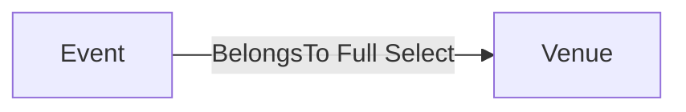

Requirement Specification 4/9/2026

MCP defaults for a common project. Grammar stays open (any identifier). Tag the contract now; generate ngin when a second platform exists. Do not dump unused names into `keywords.md`.

## Types

| Type | Notes |
| --- | --- |
| `i8` `i16` `i32` `i64` | `unsigned` is an attribute (`i32<unsigned>`), not a type |
| `float` `double` | |
| `string` `boolean` `datetime` | widget `Datetime` ≠ type `datetime` |
| `relationship` | pointer at another model; see cases |

Aliases (suggest only; do not rewrite the example app): `text_type` → `string`, `int_type` → `i32`, `bool_type` → `boolean`.

## Traits

| Trait | On |
| --- | --- |
| `Data` | records with fields |
| `Enum` | empty / discriminant models |

## Attributes

| Group | Flags |
| --- | --- |
| Identity | `nullable` `unique` `default(...)` `required` `local` |
| Validation | `min` `max` (numeric); `min_length` `max_length` `regex` `email` `phone_no` |
| Relationship | `model(...)`; cardinality `OneToOne` `OneToMany` `ManyToMany` `BelongsTo`; dependency `Partial` `Full` `Transitive` |
| UI widgets | `Text` `Select` `Checkbox` `Range` `DateRange` `Date` `Datetime` `DatetimeRange` `Radio` `AsyncSelect` `Upload` |

Type is not the widget. `string` + `Select` is valid. Do not default every `string` to `Text`.

## Relationship cases

```
venue: relationship<model(Venue), BelongsTo, Full, Select>
```



| Cardinality | Typical field |
| --- | --- |
| `BelongsTo` / `OneToOne` | singular `venue` |
| `OneToMany` / `ManyToMany` | plural `venues` / `tags` |

| Dependency | Typical |
| --- | --- |
| `Full` | `required` |
| `Partial` | `nullable` |
| `Transitive` | through another relation (do not invent) |

## Invariants (MCP suggest only)

Compiler still parses. `infer_patterns` may flag these as review notes.

| Unusual pairing | Note |
| --- | --- |
| Two cardinality, widget, or dependency flags on one field | keep one |
| Cardinality / dependency / `model` on a non-`relationship` | usually relationship-only |
| `Text` or `Checkbox` on `relationship` | prefer `Select` / `AsyncSelect` |
| `Range` on `boolean` or `relationship` | |
| `unsigned` on a non-integer type | |

Future project-owned rules: [user-defined-association-rules.md](../.temp/user-defined-association-rules.md).
