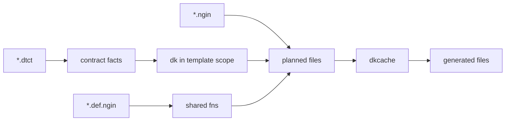

# datuma_k guide

Declare a record shape once in `*.dtct`. Write templates in `*.ngin` that turn that shape into different source for each platform. `datuma_k run` emits the files.

Shared attributes (`min`, `max`, `required`, `local`) mean the same thing everywhere. Templates map them on purpose: Pydantic `Field(ge=, le=)` in Python, Zod `.min().max()` in TypeScript.

| Layer | Role |
| --- | --- |
| `*.dtct` | Data contracts: models, traits, fields, types, attributes |
| `*.def.ngin` | Shared helper functions (case conversion, type maps) |
| `*.ngin` | Templates that open output files and emit text |
| `.dkcache` | Remembers generated spans so handwritten gaps survive `run` |

## Pages

1. [Getting started](getting-started.md) — install, `start`, a tiny contract and template, `run`
2. [Contracts](contracts.md) — `*.dtct` structure
3. [Templates](templates.md) — `*.ngin` and how to generate code
4. [Definitions](definitions.md) — `*.def.ngin` helpers
5. [Language](language.md) — the scripting language used in interp blocks and definitions
6. [Querying](querying.md) — the `dk` host API over the contract
7. [Generation](generation.md) — `run`, dkcache, and the rest of the CLI

A full FastAPI + React project generated from one contract lives in [`tests/example`](../tests/example). How to generate and start those servers: [`tests/example/README.md`](../tests/example/README.md).
